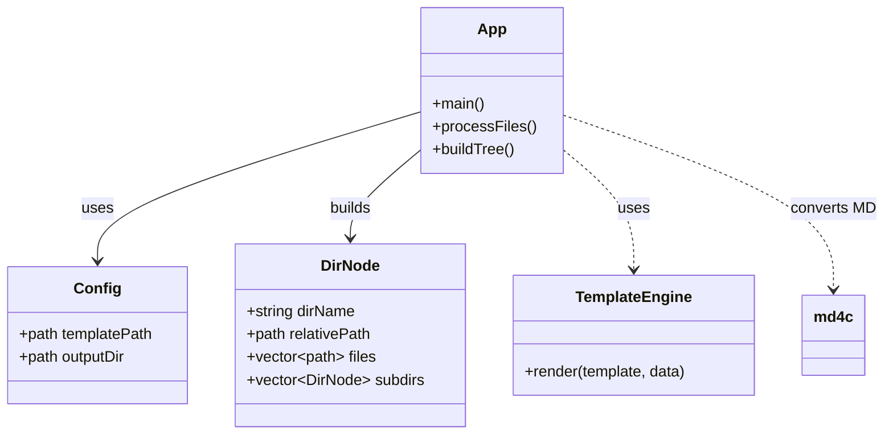
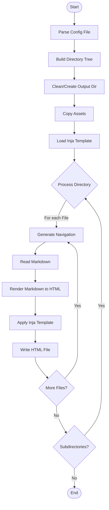

<div id="top" align="center">
<h1>Static Site Generator (SSG)</h1>

<p>A modern, high-performance Static Site Generator. It converts a recursive directory of Markdown files into a fully navigable, static HTML website using modern templating and automated asset management.</p>


[](https://github.com/Zheng-Bote/rw_gh-docs/releases)
<br/>
[Report Issue](https://github.com/Zheng-Bote/rw_gh-docs/issues) · [Request Feature](https://github.com/Zheng-Bote/rw_gh-docs/pulls)

</div>

<hr>

<!-- START doctoc generated TOC please keep comment here to allow auto update -->
<!-- DON'T EDIT THIS SECTION, INSTEAD RE-RUN doctoc TO UPDATE -->
**Table of Contents**

- [Description](#description)
  - [✨ Features](#-features)
- [⚙️ Build Instructions](#-build-instructions)
  - [🛠 Dependencies & Prerequisites](#-dependencies--prerequisites)
  - [📦 Installation](#-installation)
    - [macOS (Homebrew)](#macos-homebrew)
    - [Linux (Debian/Ubuntu)](#linux-debianubuntu)
  - [🏗 Compilation](#-compilation)
    - [Linux (GCC)](#linux-gcc)
    - [macOS (Clang)](#macos-clang)
- [🚀 Usage](#-usage)
  - [1. Project Structure](#1-project-structure)
  - [2. Configuration](#2-configuration)
  - [3. Creating the Template](#3-creating-the-template)
  - [4. Running](#4-running)
  - [5. Result](#5-result)
- [🏗 Architecture](#-architecture)
  - [Component Diagram](#component-diagram)
  - [🔄 Workflow](#-workflow)
    - [Process Flow](#process-flow)
- [🤝 Contributing](#-contributing)
- [📄 License](#-license)
- [👤 Author](#-author)
  - [Code Contributors](#code-contributors)

<!-- END doctoc generated TOC please keep comment here to allow auto update -->

<hr>

# Description


A lightweight, high-performance Static Site Generator that converts a directory of Markdown files into a static HTML website. It features recursive directory scanning, automatic navigation generation, modern templating and automated asset management.

## ✨ Features

- **Recursive Directory Scanning**: Automatically maps your folder structure to a nested navigation tree.
- **Markdown Support**: Fast parsing of .md files (CommonMark/GFM) using md4c.
- **Modern Templating**: HTML generation using the Inja template engine (Jinja-like syntax) and nlohmann/json.
- **Context-Aware Navigation**:
  - Auto-generates hierarchical HTML lists (`<ul>, <li>`).
  - Smart relative paths (../../) for assets and links.
  - Active State: Automatically highlights the current page and parent folders in the navigation.
- **Asset Management**: Recursively copies assets (CSS, images) from your template folder to the output.
- **Performance**: Built with native C++23 std::filesystem and standard algorithms.

# ⚙️ Build Instructions

## 🛠 Dependencies & Prerequisites

To build this project, you need a C++23 compatible compiler and the following libraries:

- Compiler: GCC 13+ or Clang 16+
- [md4c](https://github.com/mity/md4c) (Markdown to HTML)
- [nlohmann/json](https://github.com/nlohmann/json) (JSON for Inja context)
- [inja](https://github.com/pantor/inja) (Templating)

## 📦 Installation

### macOS (Homebrew)

```bash
brew install md4c nlohmann-json inja
# Inja is header-only, often included or needs manual download if not in brew
```

### Linux (Debian/Ubuntu)

```bash
sudo apt update && sudo apt install -y libmd4c-dev nlohmann-json3-dev
# Inja is header-only, often included or needs manual download
```

## 🏗 Compilation

### Linux (GCC)

```bash
g++ -std=c++23 -o ssg src/main5.cpp -lmd4c-html -lmd4c
```

### macOS (Clang)

```bash
clang++ -std=c++23 -o ssg main.cpp -I/opt/homebrew/include -L/opt/homebrew/lib -lmd4c-html -lmd4c
```

# 🚀 Usage

## 1. Project Structure

```bash
/MyWebsite
├── ssg                 # The compiled executable
├── config.cfg          # Configuration file
├── input/              # Your Markdown content
│   ├── index.md
│   ├── Security/
│   |   └── security.md
│   ├── Usage/
│   |   └── usage.md
│   |   └── howtos.md
│   └── Architecture/
│       └── frontend.md
│       └── backend.md
│       └── database.md
│       └── network.md
└── theme/              # Your design
    ├── template.html   # The Master HTML Template
    └── assets/         # CSS, Images, Fonts
        └── css/
        |   └── style.css
        └── js/
        |   └── script.js
        └── images/
            └── logo.png
```

## 2. Configuration

Create a file named config.cfg with the following content (Example):

```ini
template=/fullpath/to/theme/template.html
output=/fullpath/to/dist
```

## 3. Creating the Template

Create a file named template.html with the following content (Example):

```html
<!DOCTYPE html>
<html lang="en" data-theme="light" id="html">
  <head>
    <meta charset="utf-8" />
    <meta name="viewport" content="width=device-width, initial-scale=1" />

    <title>{{ title }}</title>

    <link rel="stylesheet" href="{{ base_path }}assets/css/style.css" />
    <script src="{{ base_path }}assets/js/script.js"></script>
  </head>
  <body>
    <nav>{{ navigation }}</nav>
    <main>{{ content }}</main>
    <footer>&copy; 2026 ZHENG Robert</footer>
  </body>
</html>
```

**Asset Logic**

If your template folder contains an assets subdirectory, it will be automatically copied to the output folder. Ensure your HTML template references assets using `{{ base_path }}assets/...` to ensure links work from deep subdirectories.

## 4. Running

```bash
./ssg <path_to_config> <input_folder>
```

## 5. Result

The tool will:

- Clean/Create the dist (output) folder.
- Copy theme/assets to dist/assets.
- Process all .md files in input/.
- Generate .html files in dist (output folder) maintaining the folder structure.

---

([back to top](#top))

# 🏗 Architecture

The application is structured into several modular components:

1.  **Configuration Parser**: Reads settings (template path, output directory) from a simple key-value config file.
2.  **Tree Builder**: Recursively scans the input directory to build a memory representation (`DirNode`) of the file structure.
3.  **Asset Manager**: Handles the synchronization of static assets (CSS, JS, images) from the template directory to the output directory.
4.  **Markdown Engine**: Wraps `md4c` to convert Markdown content into raw HTML.
5.  **Template Engine**: Uses `inja` to inject content, navigation, and metadata into a master HTML template.

## Component Diagram



## 🔄 Workflow

The generation process follows a linear pipeline:

1.  **Initialization**: Parse command-line arguments to get the config file and input directory.
2.  **Configuration**: Read `template` and `output` paths from the config file.
3.  **Scanning**: Traverse the input directory to build the `DirNode` tree structure.
4.  **Preparation**:
    - Clean/Create the output directory.
    - Copy assets from the template's `assets/` folder to `output/assets/`.
    - Load and parse the Inja template.
5.  **Processing (Recursive)**:
    - Create corresponding output subdirectories.
    - **For each file**:
      - Generate the **Navigation HTML** (sidebar) based on the current location in the tree.
      - Read and render the **Markdown** content to HTML.
      - Prepare the **Data Context** (JSON) with `content`, `navigation`, `title`, and `base_path`.
      - **Render** the final HTML using the Inja template.
      - Write the result to the output directory.

**Asset Logic**

If your template folder contains an assets subdirectory, it will be automatically copied to the output folder. Ensure your HTML template references assets using {{ base_path }}assets/... to ensure links work from deep subdirectories.

### Process Flow



---

([back to top](#top))

# 🤝 Contributing

Contributions are welcome! Please fork the repository and create a pull request.

1. Fork the Project
2. Create your Feature Branch (git checkout -b feature/AmazingFeature)
3. Commit your Changes (git commit -m 'Add some AmazingFeature')
4. Push to the Branch (git push origin feature/AmazingFeature)
5. Open a Pull Request

# 📄 License

Distributed under the MIT License. See LICENSE for more information.

Copyright (c) 2026 ZHENG Robert

# 👤 Author

[](https://www.github.com/Zheng-Bote)

## Code Contributors


---

([back to top](#top))

:vulcan_salute:
